# Flujo CI/CD de Inmomarket

Este flujo implementa el pipeline propuesto en el TA1 para **Inmomarket**, cuyo codigo se encuentra en el repositorio GitHub `Ourmarket`. La solucion Full Stack desacoplada usa React 18, TypeScript y Vite en el frontend; Java 21 y Spring Boot 3.4.x en el backend; PostgreSQL para persistencia; y Docker Compose para el despliegue reproducible.

El flujo se ejecuta en cada `pull request` hacia `main`, en cada `push` a `main` y manualmente desde la interfaz de GitHub.

## Diagrama

```mermaid
flowchart LR
    A[Pull request o push] --> B[Checkout]
    B --> C1[Frontend]
    B --> C2[Backend]

    subgraph CI[Integracion continua]
        C1 --> D1[npm ci]
        D1 --> E1[ESLint]
        E1 --> F1[tsc + Vite build]
        F1 --> G1[Artefacto frontend-dist]

        C2 --> D2[Java 21 + PostgreSQL]
        D2 --> E2[Maven verify + JUnit]
        E2 --> F2[Empaquetar JAR]
        F2 --> G2[Artefacto backend-jar]
    end

    G1 --> H[Construir imagen frontend]
    G2 --> I[Construir imagen backend]
    H --> J[Empaquetar imagenes Docker]
    I --> J
    J --> K{Push a main?}
    K -- No: pull request --> L[Fin de CI]
    K -- Si --> M[Docker Compose]

    subgraph CD[Entrega continua]
        M --> N[Frontend + backend + PostgreSQL]
        N --> O[Pruebas de humo]
        O --> P[Evidencia de staging simulado]
    end
```

## Etapas

1. **Compilacion del frontend:** instala exactamente las versiones de `package-lock.json`, ejecuta ESLint y genera `frontend/dist` con TypeScript y Vite.
2. **Pruebas y compilacion del backend:** levanta PostgreSQL 16 como servicio aislado y ejecuta `./mvnw verify`, que compila, corre las pruebas JUnit y genera el JAR.
3. **Contenerizacion:** tras aprobar ambos trabajos, construye las imagenes `inmomarket-frontend` e `inmomarket-backend`, tal como se propone en la seccion 10 del TA1.
4. **Despliegue simulado:** solo en un `push` a `main`, carga las imagenes y ejecuta `docker compose up` con frontend, backend y PostgreSQL en un runner temporal.
5. **Pruebas de humo y evidencia:** comprueba que la interfaz y Swagger respondan, guarda el estado y los logs de los contenedores y finalmente elimina el ambiente temporal.

El repositorio actualmente contiene la prueba JUnit `contextLoads`. Las pruebas de autenticacion/JWT, registro de inmuebles, chat, favoritos y seguridad de endpoints descritas en el TA1 son pruebas propuestas que todavia deben implementarse; el pipeline las ejecutara automaticamente cuando se incorporen en `backend/src/test`.

## Justificacion tecnica

- Los trabajos de frontend y backend se ejecutan en paralelo para reducir el tiempo total del pipeline.
- `npm ci` y los caches de npm/Maven hacen las ejecuciones reproducibles y más rápidas.
- PostgreSQL se ejecuta como contenedor de servicio con comprobacion de salud; las pruebas no dependen de una base de datos instalada manualmente.
- La construccion Docker depende de ambos trabajos de CI y el despliegue depende de las imagenes, por lo que ninguna etapa posterior puede ejecutarse si falla la calidad, la compilacion o las pruebas.
- Docker Compose reproduce la arquitectura descrita en el TA1: Nginx para el frontend, Java 21 para el backend y PostgreSQL con volumen persistente.
- Los permisos del token se limitan a lectura del contenido. El despliegue simulado no necesita secretos ni infraestructura externa y deja evidencia auditable asociada al SHA del commit.
- La concurrencia cancela ejecuciones obsoletas de la misma rama, evitando consumir minutos en builds reemplazados por un commit más reciente.

## Activacion

El archivo `.github/workflows/ci-cd.yml` queda activo cuando se confirma con un commit y se envia a GitHub. Para convertir el despliegue simulado en uno real, se puede reemplazar únicamente el trabajo `deploy-staging` por la publicación en el proveedor elegido, conservando sus dependencias y almacenando credenciales en GitHub Environments/Secrets.

## Evidencias para el informe

Después del `push`, se recomienda incluir estas capturas:

1. Pestaña **Actions** mostrando el workflow `CI/CD - Inmomarket` y la ejecucion originada por el commit.
2. Grafico de trabajos mostrando `Frontend`, `Backend`, `Docker` y `CD`.
3. Detalle de los pasos verdes de compilacion y pruebas.
4. Trabajo `CD | despliegue simulado con Docker Compose` con las pruebas de humo aprobadas.
5. Seccion **Artifacts** mostrando las imagenes Docker y la evidencia del despliegue.
